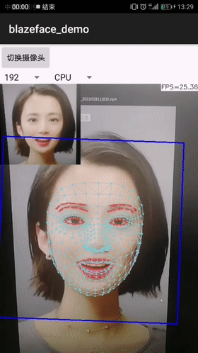

# ncnn_Android_blazeface

The BlazeFace face detection demo infer by ncnn.  

This is a sample ncnn android project, it depends on ncnn library and opencv

https://github.com/Tencent/ncnn

https://github.com/nihui/opencv-mobile
## model support  
1.[BlazeFace-FPN-SSH](https://github.com/PaddlePaddle/PaddleDetection/blob/release/2.3/configs/face_detection/README.md)(The model from PaddleDetection)  
2.[yolov5-blazeface](https://github.com/deepcam-cn/yolov5-face)(The model from yolov5-face)  
3.[Face-Mesh](https://google.github.io/mediapipe/solutions/face_mesh)(The model from mediapipe)  
## how to build and run
### step1
https://github.com/Tencent/ncnn/releases

* Download ncnn-YYYYMMDD-android-vulkan.zip or build ncnn for android yourself
* Extract ncnn-YYYYMMDD-android-vulkan.zip into **app/src/main/jni** and change the **ncnn_DIR** path to yours in **app/src/main/jni/CMakeLists.txt**

### step2
https://github.com/nihui/opencv-mobile

* Download opencv-mobile-XYZ-android.zip
* Extract opencv-mobile-XYZ-android.zip into **app/src/main/jni** and change the **OpenCV_DIR** path to yours in **app/src/main/jni/CMakeLists.txt**

### step3
* Open this project with Android Studio, build it and enjoy!

## some notes
* Android ndk camera is used for best efficiency
* Crash may happen on very old devices for lacking HAL3 camera interface
* All models are manually modified to accept dynamic input shape
* Most small models run slower on GPU than on CPU, this is common
* FPS may be lower in dark environment because of longer camera exposure time

## screenshot
  

## reference  
1.https://github.com/PaddlePaddle/PaddleDetection/blob/release/2.3/configs/face_detection/README.md  
2.https://github.com/nihui/ncnn-android-scrfd  
3.https://github.com/deepcam-cn/yolov5-face  
4.https://github.com/google/mediapipe
